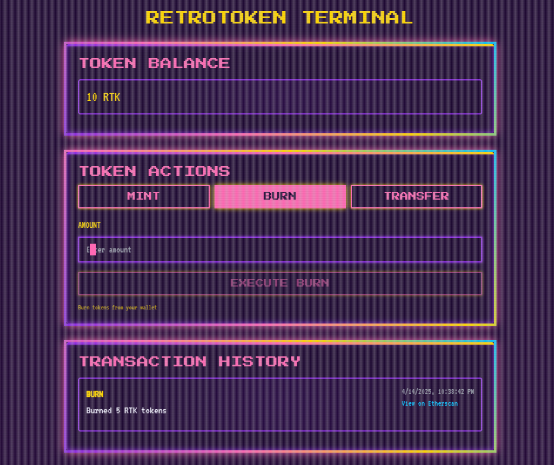

# RetroToken DApp

A retro-styled decentralized application for interacting with the RetroToken ERC20 contract. This DApp allows users to mint, burn, and transfer tokens with a vibrant retro-themed user interface.



## 🚀 Overview

RetroToken is a simple ERC20 token implementation with no maximum supply. The DApp provides an intuitive interface for:

- 💰 Minting new tokens
- 🔥 Burning tokens
- 🔄 Transferring tokens to other addresses
- 📜 Viewing transaction history with links to Etherscan

The application features a nostalgic retro design with vibrant colors, pixelated elements, and CRT-like effects for a unique user experience.

## 🏗️ Tech Stack

<table>
  <tr>
    <td align="center"><strong>Smart Contract</strong></td>
    <td align="center"><strong>Frontend</strong></td>
    <td align="center"><strong>Web3 Integration</strong></td>
    <td align="center"><strong>Infrastructure</strong></td>
  </tr>
  <tr>
    <td>
      <br/>
      <br/>
      
    </td>
    <td>
      <br/>
      <br/>
      
    </td>
    <td>
      <br/>
      <br/>
      
    </td>
    <td>
      <br/>
      <br/>
      
    </td>
  </tr>
</table>

## 📁 Project Structure

The project is organized into three main directories:

### Smart Contract (`contracts-hardhat/`)

The backend of the application containing:

- Solidity contract for the RetroToken ERC20 implementation
- Hardhat configuration for local development and testnet deployment
- Test scripts to verify contract functionality
- Deployment scripts using Hardhat Ignition

### Frontend (`frontend/`)

The user interface built with Next.js and Tailwind CSS featuring:

- Wallet connection via RainbowKit (supporting MetaMask, Coinbase Wallet, and more)
- Three main sections:

  1. **Token Balance**: Displays the user's current token balance
  2. **Token Actions**: Interface for minting, burning, and transferring tokens
  3. **Transaction History**: Shows a log of past transactions with Etherscan links

- Retro-themed styling with custom colors, fonts, and visual effects

### Subgraph (`subgraph/`)

The data indexing layer for transaction history:

- Custom schema for tracking mint, burn, and transfer events
- GraphQL API for querying historical transactions
- Deployed on Alchemy Subgraphs (powered by The Graph Protocol)
- Enables persistent transaction history across sessions

## 🔍 Subgraph Integration

RetroToken uses The Graph Protocol via Alchemy Subgraphs for efficient blockchain data indexing:

### Features

- **Persistent Transaction History**: Track all mint, burn, and transfer events across sessions
- **Efficient Querying**: Fast retrieval of historical data without scanning the entire blockchain
- **Real-time Updates**: New transactions are automatically indexed and available in the UI

### Subgraph Endpoints

- **Playground**: https://subgraph.satsuma-prod.com/[YOUR-TEAM]/retrotoken/playground
- **GraphQL API**: https://subgraph.satsuma-prod.com/[YOUR-KEY]/[YOUR-TEAM]/retrotoken/api
- **Indexing Status**: https://subgraph.satsuma-prod.com/[YOUR-KEY]/[YOUR-TEAM]/retrotoken/status

### Local Development

To modify or deploy your own subgraph:

1. Navigate to the subgraph directory:
```bash
cd RetroToken/subgraph/retrotoken-subgraph
```

2. Install dependencies:
```bash
npm install
```

3. Generate types:
```bash
graph codegen
```

4. Build the subgraph:
```bash
graph build
```

5. Deploy to Alchemy Subgraphs:
```bash
graph deploy retrotoken \
  --version-label v0.0.1 \
  --node https://subgraphs.alchemy.com/api/subgraphs/deploy \
  --deploy-key YOUR_DEPLOY_KEY \
  --ipfs https://ipfs.satsuma.xyz
```

## ⚙️ Installation & Setup

### Prerequisites

- Node.js (v16+)
- npm or yarn
- MetaMask or another Ethereum wallet browser extension

### Smart Contract Setup

1. Navigate to the smart contract directory:

  ```bash
  cd RetroToken/contracts-hardhat
  ```

2. Install dependencies:

```bash
npm install
```

3. Create a `.env` file with the following variables:
    
```bash
PRIVATE_KEY=your_wallet_private_key
SEPOLIA_RPC_URL=your_sepolia_rpc_url
ETHERSCAN_API_KEY=your_etherscan_api_key
```

4. Compile the contract:

```bash
npm run compile
```

5. Run tests:

```bash
npm run test
```

### Frontend setup

1. Navigate to the frontend directory:

```bash
cd RetroToken/frontend
```

2. Install dependencies:

```bash
npm install
```

3. Create a `.env.local` file with the following variables:

```bash
NEXT_PUBLIC_WALLETCONNECT_PROJECT_ID=your_walletconnect_project_id
```

### Running Locally

1. Start a local Hardhat node (in the contracts-hardhat directory):
```bash
npm run node
```

2. In a new terminal, deploy the contract to the local node:

```bash
npm run deploy:local
```

3. Start the frontend development server:

```bash
npm run frontend
```

### Deploying to Testnet

1. Deploy the contract to Sepolia testnet:
```bash
npm run deploy:sepolia
```

2. Verify the contract on Etherscan:
```bash
npm run verify YOUR_CONTRACT_ADDRESS
```

3. The frontend will automatically update with the deployed contract address

### Additional Hardhat Commands
This project demonstrates a basic Hardhat use case. Try running some of the following tasks:

```shell
npx hardhat help
npx hardhat test
REPORT_GAS=true npx hardhat test
npx hardhat node
npx hardhat ignition deploy ./ignition/modules/RetroTokenModule.ts
```

## 🌟 Features

- **Wallet Integration**: Seamless connection with popular crypto wallets
- **Token Management**: Mint, burn and transfer tokens with a few clicks
- **Transaction History**: Complete record of all user transactions
- **Network Display**: Clear indication of the connected blockchain network
- **Responsive Design**: Works on desktop and mobile devices
- **Real-time Updates**: Balance and token info refresh automatically after transactions

## 📝 License
MIT